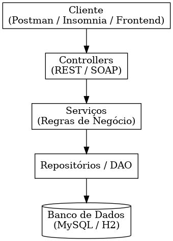
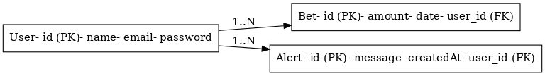

# 🎰 Aposta Consciente XP

Projeto acadêmico desenvolvido com foco em arquitetura orientada a serviços (SOA), utilizando boas práticas de integração entre sistemas, autenticação com JWT e um módulo de análise de comportamento para apostas conscientes.

---

## 🚀 Tecnologias Utilizadas

- ✅ Java 17+
- ✅ Spring Boot 3.2.0
- ✅ Spring Data JPA + Hibernate
- ✅ Spring Security + JWT
- ✅ MySQL 8.0
- ✅ Flyway (Migrações de banco)
- ✅ Bean Validation
- ✅ Swagger/OpenAPI 3
- ✅ Maven

---

## 📂 Estrutura do Projeto

```
src/main/java/br/com/fiap/consciousbet/
├── config/        # Configurações (Security, Swagger, Database)
├── controller/    # Controllers REST (User, Bet, Auth)
├── dto/           # Data Transfer Objects
│   ├── UserCreateDTO, UserUpdateDTO, UserResponseDTO
│   └── BetCreateDTO, BetUpdateDTO, BetResponseDTO
├── entity/        # Entidades JPA (User, Bet, UserAuth)
├── exception/     # Tratamento global de exceções
├── mapper/        # Conversão Entity ↔ DTO
├── repository/    # Repositories JPA com queries customizadas
├── security/      # JWT Filter e utilitários
├── service/       # Interfaces de serviços
└── serviceimpl/   # Implementações dos serviços

src/main/resources/
├── db/migration/  # Scripts Flyway (V1, V2, V3, V4)
└── application.properties
```

---

## ⚙️ Configuração e Execução

### 1. Pré-requisitos
- Java 17+
- MySQL 8.0
- Maven 3.6+

### 2. Configuração do Banco
```sql
CREATE DATABASE consciousbet;
CREATE USER 'consciousbet'@'localhost' IDENTIFIED BY 'sua_senha';
GRANT ALL PRIVILEGES ON consciousbet.* TO 'consciousbet'@'localhost';
```

### 3. Configuração da aplicação
Edite `src/main/resources/application.properties`:
```properties
spring.datasource.url=jdbc:mysql://localhost:3306/consciousbet
spring.datasource.username=root
spring.datasource.password=sua_senha
```

### 4. Executar a aplicação
```bash
git clone https://github.com/LucasVinicius45/Consciousbet
cd consciousbet
mvn clean install
mvn spring-boot:run
```

### 5. Acessar a aplicação
- **API Base:** http://localhost:8080
- **Swagger UI:** http://localhost:8080/swagger-ui.html
- **Documentação OpenAPI:** http://localhost:8080/v3/api-docs

---

## 🔐 Autenticação JWT

### 1. Login (obter token)
```http
POST /auth/login
Content-Type: application/json

{
  "email": "admin@email.com",
  "password": "123456"
}
```

**Resposta:**
```json
{
  "token": "eyJhbGciOiJIUzUxMiJ9...",
  "email": "admin@email.com",
  "message": "Login successful",
  "tokenType": "Bearer"
}
```

### 2. Usando o token
Adicione o header em todas as requisições protegidas:
```
Authorization: Bearer seu_token_aqui
```

---

## 📡 Endpoints da API

### 🔑 Autenticação (`/auth`)
| Método | Endpoint         | Descrição                | Auth |
|--------|------------------|--------------------------|------|
| POST   | /auth/login      | Login e geração de token | ❌   |
| GET    | /auth/validate   | Validar token JWT        | ✅   |
| POST   | /auth/refresh    | Renovar token            | ✅   |

### 👤 Usuários (`/api/users`)
| Método | Endpoint              | Descrição                    | Auth |
|--------|-----------------------|------------------------------|------|
| POST   | /api/users            | Criar usuário                | ✅   |
| GET    | /api/users            | Listar usuários (paginado)   | ✅   |
| GET    | /api/users/list       | Listar todos (lista simples) | ✅   |
| GET    | /api/users/{id}       | Buscar usuário por ID        | ✅   |
| GET    | /api/users/email/{email} | Buscar por email           | ✅   |
| PUT    | /api/users/{id}       | Atualizar usuário completo   | ✅   |
| PATCH  | /api/users/{id}       | Atualizar parcialmente       | ✅   |
| DELETE | /api/users/{id}       | Deletar usuário              | ✅   |
| GET    | /api/users/count      | Contar total de usuários     | ✅   |

### 🎲 Apostas (`/api/bets`)
| Método | Endpoint                    | Descrição                      | Auth |
|--------|-----------------------------|--------------------------------|------|
| POST   | /api/bets                   | Criar aposta                   | ✅   |
| GET    | /api/bets                   | Listar apostas (paginado)      | ✅   |
| GET    | /api/bets/list              | Listar todas (lista simples)  | ✅   |
| GET    | /api/bets/{id}              | Buscar aposta por ID           | ✅   |
| GET    | /api/bets/user/{userId}     | Apostas de um usuário          | ✅   |
| GET    | /api/bets/user/{userId}/recent | Apostas recentes (24h)       | ✅   |
| GET    | /api/bets/type/{type}       | Apostas por tipo               | ✅   |
| GET    | /api/bets/status/{status}   | Apostas por status             | ✅   |
| PUT    | /api/bets/{id}              | Atualizar aposta               | ✅   |
| PATCH  | /api/bets/{id}              | Atualizar parcialmente         | ✅   |
| PATCH  | /api/bets/{id}/status       | Atualizar apenas status        | ✅   |
| PATCH  | /api/bets/{id}/cancel       | Cancelar aposta                | ✅   |
| DELETE | /api/bets/{id}              | Deletar aposta                 | ✅   |
| GET    | /api/bets/user/{userId}/stats | Estatísticas do usuário      | ✅   |

### 🚨 Análise de Risco (`/bets`)
| Método | Endpoint            | Descrição                    | Auth |
|--------|---------------------|------------------------------|------|
| GET    | /bets/alerts/{userId} | Análise comportamental     | ✅   |

---

## 📋 Exemplos de Uso

### Criar Usuário
```http
POST /api/users
Authorization: Bearer seu_token
Content-Type: application/json

{
  "name": "João Silva",
  "email": "joao@email.com",
  "age": 28
}
```

### Criar Aposta
```http
POST /api/bets
Authorization: Bearer seu_token
Content-Type: application/json

{
  "userId": 1,
  "amount": 50.00,
  "type": "SPORTS",
  "description": "Brasil vs Argentina - Copa do Mundo"
}
```

### Análise de Risco
```http
GET /bets/alerts/1
Authorization: Bearer seu_token
```

**Resposta:**
```json
{
  "risk": true,
  "message": "Comportamento de risco detectado: 5 apostas totalizando R$ 250,00 nas últimas 24 horas.",
  "suggestion": "Com R$ 250,00, você poderia investir em um CDB que rende aproximadamente R$ 2,50 por mês."
}
```

---

## 🗄️ Banco de Dados

### Estrutura das Tabelas
- **users**: Usuários do sistema
- **auth_users**: Dados de autenticação
- **bets**: Apostas realizadas
- **flyway_schema_history**: Controle de migrações

### Migrações Flyway
- `V1__Create_tables.sql`: Tabelas principais
- `V2__create_auth_users.sql`: Tabela de autenticação
- `V3__Add_timestamps_to_users.sql`: Timestamps de auditoria
- `V4__Update_bets_table.sql`: Melhorias na tabela de apostas

---

## 🛡️ Validações e Regras de Negócio

### Usuários
- Nome: 2-100 caracteres
- Email: Formato válido e único
- Idade: 18-120 anos

### Apostas
- Valor mínimo: R$ 1,00
- Valor máximo por aposta: R$ 2.000,00
- Limite diário: R$ 5.000,00
- Máximo de 20 apostas por dia
- Tipos válidos: SPORTS, CASINO, LOTTERY, POKER
- Status: PENDING, ACTIVE, WON, LOST, CANCELLED

---

## 🔍 Análise de Risco

O sistema monitora padrões de apostas e oferece:
- **Alertas de risco** baseados em frequência e valores
- **Sugestões de investimento** como alternativa
- **Limites automáticos** para proteção do usuário

---
## 📊 Diagramas do Projeto

### Arquitetura
[🔗 Ver Arquitetura](docs/img/arquitetura.png)



---

### Modelo ER
[🔗 Ver Diagrama ER](docs/img/er.png)



---

## 👨‍💻 Autores

- **Irana Pereira** – RM98593
- **Lucas Vinicius** – RM98480
- **Mariana Melo** – RM98121
- **Mateus Iago** – RM550270

**Instituição:** FIAP  
**Disciplina:** Arquitetura Orientada a Serviços  
**Professor:** Carlos Eduardo Machado